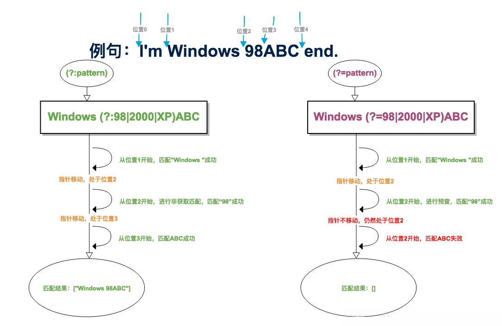

# 正则表达式

## 正则表达式基础知识

<table cellspacing="0">
<tbody>
<tr valign="top"><th width="16%">字符</th><th width="84%">描述</th></tr>
<tr valign="top">
    <td width="16%">\</td><td width="84%">将下一个字符标记为一个特殊字符、或一个原义字符、或一个 向后引用、或一个八进制转义符。例如，'n' 匹配字符 "n"。'\n' 匹配一个换行符。序列 '\' 匹配 "\" 而 "(" 则匹配 "("。</td>
</tr>
<tr valign="top"><td width="16%">^</td><td width="84%">匹配输入字符串的开始位置。如果设置了 <strong>RegExp</strong> 对象的 <strong>Multiline</strong> 属性，^ 也匹配 '\n' 或 '\r' 之后的位置。</td></tr>
<tr valign="top"><td width="16%">$</td><td width="84%">匹配输入字符串的结束位置。如果设置了<strong>RegExp</strong> 对象的 <strong>Multiline</strong> 属性，$ 也匹配 '\n' 或 '\r' 之前的位置。</td></tr>
<tr valign="top"><td width="16%"><em></em></td><td width="84%">匹配前面的子表达式零次或多次。例如，zo 能匹配 "z" 以及 "zoo"。<em> 等价于{0,}。</em></td></tr>
<tr valign="top"><td width="16%">+</td><td width="84%">匹配前面的子表达式一次或多次。例如，'zo+' 能匹配 "zo" 以及 "zoo"，但不能匹配 "z"。+ 等价于 {1,}。</td></tr>
<tr valign="top"><td width="16%">?</td><td width="84%">匹配前面的子表达式零次或一次。例如，"do(es)?" 可以匹配 "do" 或 "does" 中的"do" 。? 等价于 {0,1}。</td></tr>
<tr valign="top"><td width="16%">{<em>n</em>}</td><td width="84%"><em>n</em> 是一个非负整数。匹配确定的 <em>n</em> 次。例如，'o{2}' 不能匹配 "Bob" 中的 'o'，但是能匹配 "food" 中的两个 o。</td></tr>
<tr valign="top"><td width="16%">{<em>n</em>,}</td><td width="84%"><em>n</em> 是一个非负整数。至少匹配<em>n</em> 次。例如，'o{2,}' 不能匹配 "Bob" 中的 'o'，但能匹配 "foooood" 中的所有 o。'o{1,}' 等价于 'o+'。'o{0,}' 则等价于 'o'。</td></tr>
<tr valign="top"><td width="16%">{<em>n</em>,<em>m</em>}</td><td width="84%"><em>m</em> 和 <em>n</em> 均为非负整数，其中<em>n</em> &lt;= <em>m</em>。最少匹配 <em>n</em> 次且最多匹配 <em>m</em> 次。例如，"o{1,3}" 将匹配 "fooooood" 中的前三个 o。'o{0,1}' 等价于 'o?'。请注意在逗号和两个数之间不能有空格。</td></tr>
<tr valign="top"><td width="16%">?</td><td width="84%">当该字符紧跟在任何一个其他限制符 (<em>, +, ?, {<em>n</em>}, {<em>n</em>,}, {<em>n</em>,<em>m</em>}) 后面时，匹配模式是非贪婪的。非贪婪模式尽可能少的匹配所搜索的字符串，而默认的贪婪模式则尽可能多的匹配所搜索的字符串。例如，对于字符串 "oooo"，'o+?' 将匹配单个 "o"，而 'o+' 将匹配所有 'o'。</em></td></tr>
<tr valign="top"><td width="16%">.</td><td width="84%">匹配除 "\n" 之外的任何单个字符。要匹配包括 '\n' 在内的任何字符，请使用象 '[.\n]' 的模式。</td>
<tr valign="top"><td width="16%">(<em>pattern</em>)</td><td width="84%">匹配 <em>pattern</em> 并获取这一匹配。所获取的匹配可以从产生的 Matches 集合得到，在VBScript 中使用 <strong>SubMatches</strong> 集合，在JScript 中则使用 <strong>$0</strong>…<strong>$9</strong> 属性。要匹配圆括号字符，请使用 '(' 或 ')'。</td></tr>
<tr valign="top"><td width="16%">(?:<em>pattern</em>)</td><td width="84%">匹配 <em>pattern</em> 但不获取匹配结果，也就是说这是一个非获取匹配，不进行存储供以后使用。这在使用 "或" 字符 (|) 来组合一个模式的各个部分是很有用。例如， 'industr(?:y|ies) 就是一个比 'industry|industries' 更简略的表达式。</td></tr>
<tr valign="top"><td width="16%">(?=<em>pattern</em>)</td><td width="84%">正向预查，在任何匹配 <em>pattern</em> 的字符串开始处匹配查找字符串。这是一个非获取匹配，也就是说，该匹配不需要获取供以后使用。例如，'Windows (?=95|98|NT|2000)' 能匹配 "Windows 2000" 中的 "Windows" ，但不能匹配 "Windows 3.1" 中的 "Windows"。预查不消耗字符，也就是说，在一个匹配发生后，在最后一次匹配之后立即开始下一次匹配的搜索，而不是从包含预查的字符之后开始。</td></tr>
<tr valign="top"><td width="16%">(?!<em>pattern</em>)</td><td width="84%">负向预查，在任何不匹配 <em>pattern</em> 的字符串开始处匹配查找字符串。这是一个非获取匹配，也就是说，该匹配不需要获取供以后使用。例如'Windows (?!95|98|NT|2000)' 能匹配 "Windows 3.1" 中的 "Windows"，但不能匹配 "Windows 2000" 中的 "Windows"。预查不消耗字符，也就是说，在一个匹配发生后，在最后一次匹配之后立即开始下一次匹配的搜索，而不是从包含预查的字符之后开始</td></tr>
<tr valign="top"><td width="16%"><em>x</em>|<em>y</em></td><td width="84%">匹配 <em>x</em> 或 <em>y</em>。例如，'z|food' 能匹配 "z" 或 "food"。'(z|f)ood' 则匹配 "zood" 或 "food"。</td></tr>
<tr valign="top"><td width="16%">[<em>xyz</em>]</td><td width="84%">字符集合。匹配所包含的任意一个字符。例如， '[abc]' 可以匹配 "plain" 中的 'a'。</td></tr>
<tr valign="top"><td width="16%">[^<em>xyz</em>]</td><td width="84%">负值字符集合。匹配未包含的任意字符。例如， '[^abc]' 可以匹配 "plain" 中的'p'。</td></tr>
<tr valign="top"><td width="16%">[<em>a-z</em>]</td><td width="84%">字符范围。匹配指定范围内的任意字符。例如，'[a-z]' 可以匹配 'a' 到 'z' 范围内的任意小写字母字符。</td></tr>
<tr valign="top"><td width="16%">[^<em>a-z</em>]</td><td width="84%">负值字符范围。匹配任何不在指定范围内的任意字符。例如，'[^a-z]' 可以匹配任何不在 'a' 到 'z' 范围内的任意字符。</td></tr>
<tr valign="top"><td width="16%">&nbsp;</td><td width="84%">匹配一个单词边界，也就是指单词和空格间的位置。例如， 'er' 可以匹配"never" 中的 'er'，但不能匹配 "verb" 中的 'er'。</td></tr>
<tr valign="top"><td width="16%">\B</td><td width="84%">匹配非单词边界。'er\B' 能匹配 "verb" 中的 'er'，但不能匹配 "never" 中的 'er'。</td></tr>
<tr valign="top"><td width="16%">\c<em>x</em></td><td width="84%">匹配由 <em>x </em>指明的控制字符。例如， \cM 匹配一个 Control-M 或回车符。<em>x</em> 的值必须为 A-Z 或 a-z 之一。否则，将 c 视为一个原义的 'c' 字符。</td>
<tr valign="top"><td width="16%">\d</td><td width="84%">匹配一个数字字符。等价于 [0-9]。</td></tr>
<tr valign="top"><td width="16%">\D</td><td width="84%">匹配一个非数字字符。等价于 [^0-9]。</td></tr>
<tr valign="top"><td width="16%">\f</td><td width="84%">匹配一个换页符。等价于 \x0c 和 \cL。</td></tr>
<tr valign="top"><td width="16%">\n</td><td width="84%">匹配一个换行符。等价于 \x0a 和 \cJ。</td></tr>
<tr valign="top"><td width="16%">\r</td><td width="84%">匹配一个回车符。等价于 \x0d 和 \cM。</td></tr>
<tr valign="top"><td width="16%">\s</td><td width="84%">匹配任何空白字符，包括空格、制表符、换页符等等。等价于 [ \f\n\r\t\v]。</td></tr>
<tr valign="top"><td width="16%">\S</td><td width="84%">匹配任何非空白字符。等价于 [^ \f\n\r\t\v]。</td></tr>
<tr valign="top"><td width="16%">\t</td><td width="84%">匹配一个制表符。等价于 \x09 和 \cI。</td></tr>
<tr valign="top"><td width="16%">\v</td><td width="84%">匹配一个垂直制表符。等价于 \x0b 和 \cK。</td></tr>
<tr valign="top"><td width="16%">\w</td><td width="84%">匹配包括下划线的任何单词字符。等价于'[A-Za-z0-9<em>]'。</em></td></tr>
<tr valign="top"><td width="16%">\W</td><td width="84%">匹配任何非单词字符。等价于 '[^A-Za-z0-9]'。</td></tr>
<tr valign="top"><td width="16%">\x<em>n</em></td><td width="84%">匹配 <em>n</em>，其中 <em>n</em> 为十六进制转义值。十六进制转义值必须为确定的两个数字长。例如，'\x41' 匹配 "A"。'\x041' 则等价于 '\x04' &amp; "1"。正则表达式中可以使用 ASCII 编码。.</td></tr>
<tr valign="top"><td width="16%">\<em>num</em></td><td width="84%">匹配 <em>num</em>，其中 <em>num</em> 是一个正整数。对所获取的匹配的引用。例如，'(.)\1' 匹配两个连续的相同字符。</td></tr>
<tr valign="top"><td width="16%">\<em>n</em></td><td width="84%">标识一个八进制转义值或一个向后引用。如果 \<em>n</em> 之前至少 <em>n</em> 个获取的子表达式，则 <em>n</em> 为向后引用。否则，如果 <em>n</em> 为八进制数字 (0-7)，则 <em>n</em> 为一个八进制转义值。</td></tr>
<tr valign="top"><td width="16%">\<em>nm</em></td><td width="84%">标识一个八进制转义值或一个向后引用。如果 \<em>nm</em> 之前至少有 <em>nm</em> 个获得子表达式，则 <em>nm</em> 为向后引用。如果 \<em>nm</em> 之前至少有 <em>n</em> 个获取，则 <em>n</em> 为一个后跟文字 <em>m </em>的向后引用。如果前面的条件都不满足，若<em>n</em> 和 <em>m</em> 均为八进制数字 (0-7)，则 \<em>nm</em> 将匹配八进制转义值 <em>nm</em>。</td>
<tr valign="top"><td width="16%">\<em>nml</em></td><td width="84%">如果 <em>n</em> 为八进制数字 (0-3)，且 <em>m</em> 和 <em>l</em> 均为八进制数字 (0-7)，则匹配八进制转义值 <em>nml。</em></td></tr>
<tr valign="top"><td width="16%">\u<em>n</em></td><td width="84%">匹配 <em>n</em>，其中 <em>n</em> 是一个用四个十六进制数字表示的 Unicode 字符。例如， \u00A9 匹配版权符号 (©)。</td></tr>
</tbody>
</table>

## 正则使用

### 一、正则表达式是什么？怎样创建正则表达式？

正则表达式是什么？
正则表达式是一种模式，用以描述某种类型的内容，通常用来筛选字符串，它的缩写是RegExp

* 创建正则表达式的方法


    * 构造正则表达式
    可以使用关键词new和RegExp构造一个正则表达式，这种方法可以传入一个字符串用作正则表达式的匹配：

    ```js
        let a = new RegExp("rr")
        // a等于/rr/
    ```

    * 使用字面量创建正则表达式
    和用字面量创建数组的方式相同，正则表达式可以用字面量的方式进行创建，和数组不同的是，正则表达式是以斜杠进行包裹的：

    ```js
        let a=/rr/g;
    ```


### 二、匹配模式

正则表达式中，有三种匹配模式，分别是全局匹配(g)、忽略大小写匹配(i)、多行匹配(m)


* 全局匹配(g)
全局匹配表示对整个字符串所有的字符进行匹配，如果有多个符合的结果，就返回多个结果，不是全局匹配的话，只会返回一个结果，对比如下：
```js
    let a = "abcabc";
    let reg = /abc/
    let reg2 = /abc/g
    a.match(reg) //返回结果 ['abc']
    a.match(reg2) //返回结果 ['abc','abc']
```

* 忽略字母大小写匹配(i)
在没有设定忽略字母大小写匹配时，正则表达式是会区分字母大小写的，设定后，就不区分大小写了：

```js
    let a = 'abcAbc';
    let reg = /abc/gi
    let reg2 = /abc/g
    a.match(reg) // 返回结果为 ['abc','Abc']
    a.match(reg2) // 返回结果为 ['abc']
```


* 多行匹配(m)
正则表达式进入多行匹配模式时，对每一行都会进行重新匹配;


### 三、范围匹配以及条件匹配


#### 范围匹配
例如：[abc]、[a-z]、[0-9]等，特征是用方括号括起来，[abc]就是代表abc三个字母，[a-z]就是代表26个小写字母范围的缩写模式，用中横线-链接，此外，表示所有大小写字母可以使用[A-z]表示：


* 非匹配
非匹配符号是^，当它写在范围匹配的方括号内时就是非匹配，代表匹配非某范围内字符的其它字符；
例如：[^abc]就是匹配非abc字符的其它字符：


* 或匹配
或匹配符号是|，代表匹配任意指定项：
例子：/a|b|c/就是匹配字符串中的a或者b或者c字母：


### 四、匹配某类型的字符


* 匹配所有字母数字和下划线（非字母数字下划线字符）


    * \w代表所有的字母数字和下划线：


    * \W代表所有的非字母数组下划线的字符，这个W是大写的


* 匹配所有的数字（非数字字符）

    * \d用以匹配所有的数字

    * \D用以匹配所有的非数字

* 匹配所有的空白字符(空格、换行、回车、tab)

    * \s用以匹配所有的空白字符

    * \S用以匹配所有的非空白字符


* 匹配单词边界（非单次边界字符）：

    * \b匹配单词边界---`单词边界就是单词和符号之间的边界`

    * \B匹配非单词边界---`符号与符号,单词与单词的边界`

    **\b匹配的单次边界不是空白字符，是一个单词的两侧，通常在\b前或后加单词来使用**


* 匹配所有类型字符

在正则表达式中.表示所有的字符，不过这个所有要除去换行符和行结束符


匹配换行符
\n用来匹配字符串中的换行符


### 五、匹配字符的数量规则


* 问号?代表匹配的字符最多1个，尽量少匹配：


* 星号*代表匹配的字符0个到无数个，尽量多的去匹配：

* 加号+代表匹配的字符至少1个，尽量多的去匹配：


* 自定义匹配字符数量

除了上面三种外，还可以使用大括号{}，包裹匹配的数量，
例如：{2,4}就是最少有2个，最多有4个；
{2,}表示最少有2个；
{,2}表示最多有2个；


### 六、匹配开头和结尾的字符


* 匹配开头的字符使用符号^，要注意的是这个^和非匹配的^区别在于，匹配开头字符的^是在中括号外面的


* 匹配结尾字符使用符号$


### 七、正则表达式内置方法

正则表达式的两个内置方法


* test()方法用以判断一个字符串是否匹配该正则表达式的，参数为需要进行匹配的字符串，返回一个布尔值


* exec()方法用来查找字符串中是否有匹配该正则表达式的字符，并且返回一个匹配字符所组成的一个数组


### 八、字符串操作与正则表达式

字符串内置方法中，能够很好地与正则表达式结合起来使用的有：

> match、 search、 replace、 split


* match()方法用检索字符串中符合正则表达式的字符，并返回一个有符合字符组成的数组：

* search()方法用于查询字符串中符合正则的字符的索引，并返回这个索引，没有找到返回-1，这个方法只能返回第一个匹配到的字符的索引位置


* split()方法用于将字符串转换为数组，参数是字符串转换数组后间隔的参照物，但是有一些复杂的转换就比较麻烦了，这时候我们可以使用正则表达式对字符串进行筛选后再组成数组：
例如，将'a1b2c3d4'这个字符串中的数字筛选出来组成数组：

```js
    let a = 'a1b2c3d4';
    let reg = /[a-z]*/g
    a.split(reg) //返回结果 ["",'1','2','3','4']
```


* replace()方法可以传入两个参数，第一个是字符串中需要被替换的字符，第二个是用以替换的字符，但是如果只是传入两个字符，那么它只能替换一次，如果和正则表达式结合起来使用，就能利用正则的全局匹配进行多次替换，甚至更加复杂的操作：


进行多次替换：
例子：将a1b2c3d4字符串中的数字全部换成中横线：


多次替换


进行更复杂的操作：
例子：将将a1b2c3d4字符串中的字母全部换成大写


## (?:pattern)与(?=pattern)的区别

共同点
`(?:pattern)` 与 `(?=pattern)`都匹配pattern，但不会把pattern结果放到Matches的集合中。

* 区别

`(?:pattern) `匹配得到的结果包含pattern，`(?=pattern)` 则不包含。如：

对字符串："industry abc"的匹配结果:  
industr(?:y|ies) ---> "industry"  
industr(?=y|ies) ---> "industr"

* 是否消耗字符 

`(?:pattern)` 消耗字符，下一字符匹配会从已匹配后的位置开始。 

`(?=pattern)` 不消耗字符，下一字符匹配会从预查之前的位置开始。 

即后者只预查，不移动匹配指针




## 正则表达式的贪婪模式与非贪婪模

* 贪婪模式
上面的匹配模式就是贪婪模式的匹配方式，贪婪模式也是正则表达式的默认匹配方式。

* 非贪婪模式的匹配方式

如果想要对该字符串进行非贪婪模式的匹配，我们就需要对正则/!.+!/进行改写，改写成如下代码：

```js
var b = /!.+?!/g
```
其中，g表示采用全局匹配的模式进行匹配，而?则会使该正则式使用非贪婪模式进行匹配，该正则就会以最小的.的重复数进行匹配。

