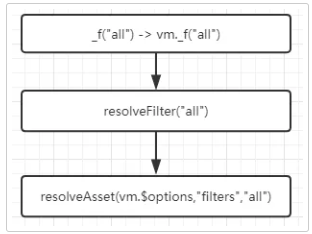
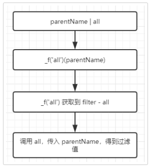
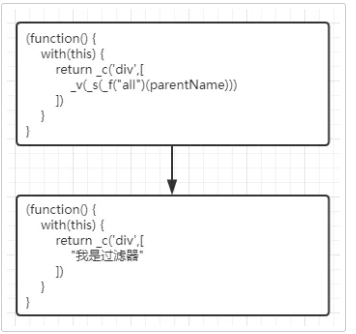

# Filters - 源码版

这里有一个过滤器 all，用来过滤 parentName 

`<div>{{parentName|all }}</div>`

```js
new Vue({    

    el:document.getElementsByTagName("div")[0],

    data(){        

        return {            

            parentName:111

        }
    },    

    filters:{

        all(){  return "我是过滤器" }

    }
})
```

**页面的 filter 解析成什么**

首先，上面的例子会被解析成下面的渲染函数

```js
(function() {      
    with(this) {            
        return _c('div',[                
            _v(_s(_f("all")(parentName)))            
        ])      
    }
}
```

这段代码继续解释下

1. `_c` 是渲染组件的函数，这里会渲染出根组件

2. 这是匿名自执行函数，后面渲染的时候调用，会 `绑定当前实例为作用域`

3. `with` 的作用是，绑定大括号内代码的 变量访问作用域，所以里面的所有变量都会从 实例上获取

然后，你可以看到 `' parentName | all ' 被解析成 _f('all')( parentName )`

**怎么解析的？**

简单说就是，当匹配到 | 这个符号，就知道你用过滤器，然后就解析成 _f 去获取对应过滤器 并调用

**_f 是什么？**

_f 是获取具体过滤器的函数

1. _f 会在Vue 初始化的时候，注册到 Vue 的原型上

```js
// 已简化

function installRenderHelpers(target) {

      target._s = toString;
      target._f = resolveFilter;
}
installRenderHelpers(Vue.prototype);
```

所在在 上面的 渲染函数 with 绑定当前实例vm为作用域 之后，_f 从vm 获取，成了这样 vm._f 


2. _f 是 resolveFilter，一个可以获取 具体filter 的函数

使用 _f("all") 就能获取到 all 这个过滤器，resolveFilter 下面会说

**设置的 filter 如何被调用**

由上面可以看到，_f 是 resolveFilter 赋值的，下面是 resolveFilter 源码

```js
// 已简化

function resolveFilter(id) {    

    return resolveAsset(

        this.$options, 'filters', id, true

    ) || identity

}
```

this.options 会拿到当前组件的所有选项

**你问我为什么？**

根据上一个问题知道

1. _f  会使用 实例去调用 ，vm._f  类等 vm.resolveFilter

2. 所以，resolveFilter 的 执行上下文 this 是 vm

3. 所以，this.$options 就是 实例的 options 啦

接着，调用 resolveAsset ，目的就是拿到 组件选项中的 具体 filter

传入 当前组件的选项 ，指定要其选项 filters ，指定具体 filter 名 

```js
function resolveAsset( 

    options, type, id, warnMissing

) {      

    // g：拿到  filters 选项

    var assets = options[type];      

    // g：返回 调用的 filter

    return assets[id]
}

```

_f("all") 流程 就成了下面这样



1. 拿到 组件选项 中的 filters

2. 然后再从 filters 中，拿到 all 这个filter

3. 执行返回的 all 过滤函数时，传入需要过滤的值 parentName

4. 得到 返回了 过滤后的值



所以，当渲染函数解析的时候，碰到使用过滤器的地方，按流程拿到过滤值后，就可以渲染到页面上了

`_f("all")(parentName))` 就会变成 "我是过滤器" 放到 渲染函数中，最后，就是渲染到页面了

