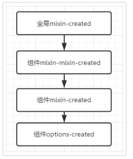
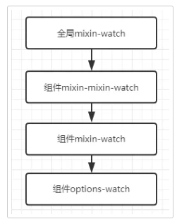
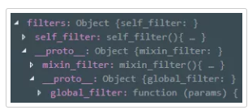

# Mixin - 白话版

今天我们用白话文解读 mixin 的工作原理，轻松快速理解 mixin 内部工作原理。你说，你只懂怎么用的，却不懂他内部是怎么工作的，这样也不太行。

而我觉得现在出一个 白话版，是让大家有兴趣去研究源码的时候，可以提前理清一下思路。暂时没时间了解源码的，也可以先了解下内部流程，对解决一些奇奇怪怪的问题也是很有作用的

mixins 我觉得可能大家很少用把，但是这个东西真的非常有用。相当于封装，提取公共部分。


mixin不难，就是有点绕，今天我们探索两个问题

1. 什么时候合并

在 创建组件实例初始化 之前，会把 ``全局选项 和 `组间选项` 合并起来

什么是全局选项？ 就是 全局组件，全局过滤器，全局指令，全局mixin 等

1. Vue.component 注册的 【全局组件】
2. Vue.filter 注册的 【全局过滤器】
3. Vue.directive 注册的 【全局指令】
4. Vue.mixin 注册的 【全局mixin】

也就是说，你全局注册的选项，其实会被`传递引用`到你的每个组件中，这样，全局选项 和 组件选项 就会合并起来，之后组件便能访问到全局选项，然后你就可以在组件内使用全局注册的选项，比如使用 全局过滤器

其实就是像你在 自己的组件声明 components 一样，只是全局注册的话，Vue 背后偷偷给你的每个组件 都合并多一个全局选项的引用

但是为了保证全局选项不被污染，又不可能每个组件都深度克隆一份全局选项导致开销过大，所以会根据不同的选项，做不同的处理。下面会详细讲解

2. 怎么合并

**权重**

1. 组件选项
2. 组件 - mixin
3. 组件 - mixin - mixin
4.....省略无数可能存在的嵌套 mixin

x全局 选项

权重 从 1 到最后 依次减少

> 其实没有权重这个东西，但是结果是一样的，是我觉得这样好理解，加上的一个概念

下面的讲解，会使用 四种选项代号 作为例子

mixin 里面嵌套mixin 太深 很少见，而且也  难以维护，所以就只嵌套一层为例

1. 组件选项：代号为  A

2. 组件-mixin：代号为 B

3. 组件-mixin-mixin ：代号为 C

4. 全局选项 ：代号为 D

1. 函数合并叠加

包括选项：data，provide

把两个函数合并加到一个新函数中，并返回这个函数。在函数里面，会执行 那两个方法。

按照这个流程，使用代号

1. `D `和 `C` 合并成一个函数 `(CD)`，函数执行时，会执行 C ，再执行 D

2. `(CD) `和 `B` 合并成 一个函数 `(B(CD))`，函数执行时，会执行 B ，再执行 (CD)

3. `(B(CD))` 和 `A` 合并成一个函数，函数执行时，会执行 B ，再执行 (B(CD))

有点绕，简化执行流程是： A->B->C->D


data 中数据有重复的，权重大的优先，比如下面

```js
var test_mixins={
    data(){        

        return {name:34}

    }
}

var a=new Vue({    

    mixins:[test_mixins],

    data(){        

        return {name:12}

    }
})
```

可以看到，mixin 和 组件本身 的 data 都有 name 这个数据，很显然会以组件本身的为主，因为组件本身权重大

2. 数组叠加

**生命周期函数**

权重越大的越放后面，会合并成一个数组，比如created

```js
[ 
    全局 mixin - created，
    组件 mixin-mixin - created，
    组件 mixin - created，
    组件 options - created 
]
```

执行流程是



生命周期，权重小的 先执行

**watch**

合并成一个下面这样的数组，权重越大的越放后面

```js
[ 
    全局 mixin - watch，
    组件 mixin-mixin - watch，
    组件 mixin - watch，
    组件 options - watch 
]
```
执行流程是




3. 原型叠加

包括选项：components，filters，directives

两个对象合并的时候，不会相互覆盖，而是 权重小的 被放到 权重大 的 的原型上

这样权重大的，访问快些，因为作用域链短了

```js
A.__proto__ = B  
B.__proto__ = C  
C.__proto__ = D
```

两个对象合并的时候，不会

以 filter 为例，下面是四种 filter 合并

```js
// 全局 filter

Vue.filter("global_filter",function (params) {})

// mixin 的 mixin

var mixin_mixin={    

    filters:{

        mixin_mixin_filter(){}
    }
}

// mixin filter

var test_mixins={
    mixins:[mixin_mixin],    

    filters:{

        mixin_filter(){}
    }
}

// 组件 filter

var a=new Vue({    

    mixins:[test_mixins],    

    filters:{

        self_filter(){}
    }
})
```

结果就系这样..



4. 覆盖叠加

包括选项：props，methods，computed，inject 

两个对象合并，如果有重复key，权重大的覆盖权重小的

比如

组件的 props：{ name:""}
组件mixin 的 props：{ name:"", age: "" }

那么 把两个对象合并，有相同属性，以 权重大的为主，组件的 name 会替换 mixin 的name

5. 直接替换

这是默认的处理方式，当选项不属于上面的处理方式的时候，就会像这样处理，包含选项：el，template，propData 等

两个数据只替换，不合并，权重大的，会一直替换 权重小的，因为这些属于只允许存在一个，所有只使用权重大的选项

组件 设置 template，mixin 也设置 template，不用怕，组件的肯定优先

**tip**

这个好像跟 覆盖叠加 很像，其实不一样，覆盖叠加会把两个数据合并，重复的才覆盖。而这个不会合并，直接替换掉整个选项

