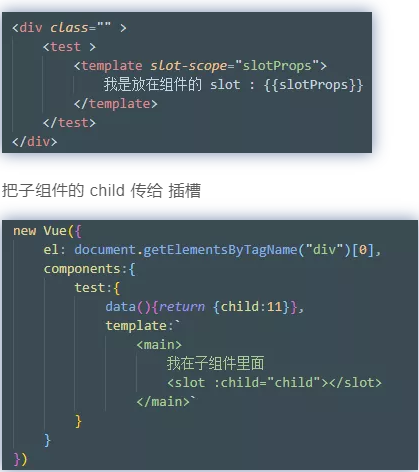

# Slot - 源码版之作用域插槽



父组件会解析成下面的渲染函数

```js
with(this) {    
    return _c('div', {},
        [_c('test', { 
            scopedSlots: _u([{                
                key: "default",                
                fn: function(slotProps) {                   
                    return [ "我是放在组件的 slot :"+slotProps ]
                }
            }])
        })],    
    1)
}
```

其中，`_u `是 `resolveScopedSlots`，Vue会给每个实例都注册一个 _u 方法。

作用主要是把数组变成对象map并返回

```js
function installRenderHelpers(target){
    target._u = resolveScopedSlots;
}

function resolveScopedSlots(fns, res) {
    res = res || {};    
    for (var i = 0; i < fns.length; i++) { 
        res[fns[i].key] = fns[i].fn;
    }    
    return res
}
```

把传入的数组组装成对象，像是下面这样

```js
[{    
    key: "default",    
    fn: function(slotProps) {        
        return ["我是放在组件的 slot :" + slotProps]
    }
}]
---------_u 把上面变成下面------
{    
    default:function(slotProps) {        
        return ["我是放在组件的 slot :" + slotProps]
    }
}
```

**插槽怎么解析**

你可以看到了，在父组件的渲染函数中，`作用域Slot` 被包装成了一个函数，并且保存在 test 组件的 `scopeSlot` 中，用于后面解析内部组件时使用

```js
// 把插槽包装成了这个函数
function(slotProps) {    
    return ["我是放在组件的 slot :" + slotProps]
}
```

包装成函数，是为了改变插槽内容的变量访问的作用域。

通过函数参数传递的形式，让插槽的变量，在解析时，先访问函数变量。如果没有，再去父组件上获取

**那么这个函数的参数是从哪里传进来的呢**


1. 插槽函数保存到外壳节点

之前的父渲染函数，子组件的插槽解析成一个节点处理函数，如下 ，然后作为 ``scopedSlots` 保存在 test 组件的`外壳节点`上

```js
{    
    tag:'test',    
    data:{
        scopedSlots:{
            // 插槽包装成的函数
            default:function(slotProps) {                   
                return [ "我是放在组件的 slot :"+slotProps ]
            }
        }
    },
    children:["我是放在组件的 slot :11"]
}
```

2. 插槽函数另存为 

然后，test组件会创建自身实例，并且初始化，在初始化的过程中，会把 外壳节点上的 `$scopedSlots`另存为到本实例上，

方便后面子组件解析内部模板直接调用

```js
// 这个函数作用是，执行渲染函数，得到组件节点

Vue.prototype._render = function() {    
    var vm = this;    
    var ref = vm.$options;
    // _parentVnode 就是外壳节点
    var _parentVnode = ref._parentVnode; 
    if (_parentVnode) {
        vm.$scopedSlots = _parentVnode.data.scopedSlots || {};
    }

    ...省略N多执行渲染函数的代码

    vm.$vnode = _parentVnode;    
    return vnode
};
```

3. 子组件解析内部

看下子组件模板，绑定了child在 slot 上，用于传给插槽

```js
<main>
    我在子组件里
    <slot v-bind:child="child"></slot>
</main>
```

执行子组件解析成的渲染函数如下

```js
with(this) {    
    return _c('main', [        
        "我在子组件里面",
        _t("default", null, {            
            child: child
        })
    ], 2)
}
```

其中，child 会从子组件上获取，所以 child 是11

渲染函数中，看到子组件中的slot的占位标签如下`<slot :child=child ></slot>`

被解析成了一个_t 函数`_t('default', null, { child:child })`

看下 `_t`，他是 `renderSlot` ，这个方法，会兼容处理 作用域Slot 和普通Slot，处理作用域Slot 的代码，现在看一下

```js
function renderSlot(name, fallback, props) { 

    // 看了上面，所以可以从实例上获取$scopedSlots
    var scopedSlotFn = this.$scopedSlots[name];   
    var nodes;    
    if (scopedSlotFn) {
        props = props || {};
        // 开始执行插槽函数
        nodes = scopedSlotFn(props);
    }    
    return nodes
}
```

`_t `的作用是，执行会直接返回节点，直接替换子组件 slot 占位符，完成插入功能

 _t 就是 `renderSlot`` ，函数会根据 `[插槽名字] `找到对应的 `[作用域Slot包装成的函数]`，然后执行它，把子组件内的数据 [{ child:child } ]`子传进去

于是，`作用域Slot` 生成的函数，就接收到了子组件传入的数据啦

所以 `作用域Slot` 就可以拿传入的参数进行解析了

**插槽怎么插入子组件**

`_t('default',null,{ child:child })`执行完毕，会返回节点，这个节点就是 slot 解析生成的节点

`[ "我是放在组件的 slot :"+ {child:11} ]`

子组件渲染函数执行完毕，生成的vnode 如下

```js
{    
    tag:'main',    
    children:[
        "我在子组件里面",
        "我是放在组件的 slot : {child:11}"
    ]
}
```

作用域插槽，成功地替换了原来的占位符 `<slot>`

**总的流程**

