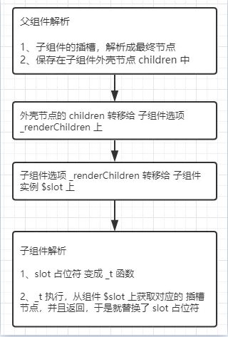

# Slot - 源码版之普通插槽

> 普通Slot，表示默认Slot和 具名Slot，只是他们的处理方式都差不多，就只是是否有自定义名字而已，所以，表示一种类型

父组件模板

```js
<div class="">
    <test>
        我是放在组件内的slot:{{name}}
    </test>
</div>
```

test 组件被定义在父组件中

```js
new Vue({    
    el: document.getElementsByTagName("div")[0],    
    components: {        
        test: {            
            template: ` 
                <main> 
                    我在子组件里面 
                    <slot></slot>
                </main> `
        }
    },
    data() {        
        return {            
            name: 11
        }
    }
})
```

**插槽内容怎么解析**

插槽的作用域，是父实例。就是说，普通插槽的变量，都是从父实例上获取的，比如上面例子插槽内的name

根据上面的例子，父组件被解析成下面的渲染函数

```js
with(this) {    

    return _c('div', {},

        [ _c('test', [

            "我是放在组件的 slot " + name 

          ]) 

    ], 1)

}
```

父渲染函数执行时，会绑定父实例为执行作用域，根据 with 的作用，test 的 slot 内的变量name，就会访问父实例上的name。

那么，当父渲染函数执行时，test组件的slot，所有变量访问父实例，并开始解析，解析的流程跟普通的模板节点是一样的

**插槽怎么插入子组件**

当父渲染函数执行完毕，会得到一个完整的VNode，上面存储着描述DOM 的所有信息，用于去创建需要的DOM。

上面的父组件，会得到这么一个vnode

```json
{    
    tag:'div',    
    children:[
       { 
        tag:'test',
        children:['我是放在组件的 slot 11'] 

       }
    ]
}
```

可以看到

1. test组件， 被当做是 父组件的一个子元素

2. test 组件内的slot ，被当做是 test元素的子元素

### test 组件内部解析

当父组件解析成功，得到一个vnode，那么下一步就是patch（创建DOM并插入页面）

此时，Vue会按照渲染好的vnode，生成对应的DOM 树，并插入到页面中

当Vue遍历到上面的vnode的children时，遇到了 test 这个节点，发现没有test这种标签，认定他是一个组件之后，会当做一个组件去解析

### Slot 转存

解析 test 组件时，使用 `_init `方法初始化 test 组件的实例

```js
Vue.prototype._init = function(options) {    
    var vm = this;    
    if (如果是组件) {
        initInternalComponent(vm, options);
    }
    initRender(vm);
}
```

初始化test实例时，上面的两个方法会起到转存 Slot 的作用

1. `initInternalComponent` 把 test 组件插槽节点 `['我是放在组件的 slot 11'] `传给组件选项的 `[_renderChildren]`中

```js
function initInternalComponent(vm, options) {    
// 这个options是全局选项和组件设置选项的合集
    var opts = vm.$options = 
            Object.create(vm.constructor.options);  
    var componentOptions = parentVnode.componentOptions;
    // 传给组件选项_renderChildren
    opts._renderChildren = componentOptions.children;

}
```

2. `initRender` 把上一步保存在 组件选项的 `[_renderChildren]`放在实例的` [$slot] `中

```js
function initRender(vm) {    
    var options = vm.$options;
    // 保存给组件实例上
    vm.$slots = resolveSlots(options._renderChildren, renderContext);
}

function resolveSlots(children, context) {    
    var slots = {};    
    for (var i = 0,l = children.length; i < l; i++) {        
        var child = children[i];        
        var data = child.data;    
        if (如果是具名slot) {} 
        else { 
            (slots.default || (slots.default = [])).push(child);
        }
    }    

    return slots

}
```

看父组件下的 test 组件的 vnode

```json
{ 
    tag:'test',    

    children:['我是放在组件的 slot 11'] 

}
```

### slot 替换到子组件

紧接着，test 实例化初始化完毕，开始使用组件模板去构建他的渲染函数

```js
<main>
    我在子组件里
    <slot></slot>
</main>
```

模板被解析成下面的渲染函数

```js
with(this) {    
    return _c('main', [        
        "我在子组件里面", 
        _t("default")
    ], 2)
}
```

你可以看到，子组件的模板中的占位符 slot，被解析成了 _t 函数-- `_t("default")`

然后，test 渲染函数执行，其中 `_t('default')` 先执行

_t 是 renderSlot 函数，Vue 会给每个实例都保存一个 _t 

作用是根据传入的名字，返回实例上$slot 保存的对应的`[插槽节点]`

```js
function installRenderHelpers(target) {
    target._t = renderSlot;
}
function renderSlot(name) {    
    return this.$slots[name]
}
```

`_t('default')` 执行完毕，返回插槽节点，于是 test 组件渲染函数就变成下面

```js
with(this) {    
    return _c('main', [        
        "我在子组件里面", 
        ['我是放在组件的 slot 11']

    ], 2)
}
```

现在，Slot 就完全插入到子组件中啦，剩下的部分，就是渲染DOM 流程，已经跟 slot 没有关系啦

**流程图**

