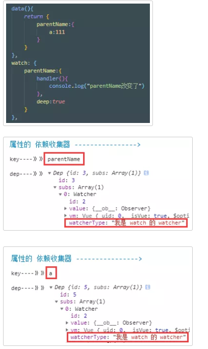

# Watch - 白话版

今天我们用白话文解读 watch 的工作原理，轻松快速理解 watch 内部工作原理。你说，你只懂怎么用的，却不懂他内部是怎么工作的，这样能有什么用？

近期有篇 《停止学习框架》很火，其实本意不是让我们不要学框架，而是让我们不要只停留在框架表面，我们要学会深入，以一敌十，让我们也要学会框架的抽象能力

watch 想必大家用得应该也挺多的，用得也很顺，如果你顺便花一点点时间了解一下内部的工作原理，相信肯定会对你的工作有事半功倍的效果

watch 的工作原理其实挺简单的，如果你有看过我之前讲解其他选项的文章，你可以一下子就明白 watch 是如何工作的，所以这边文章我也✍得很快

根据 watch 的 api，我们需要了解三个地方

```
1、监听的数据改变的时，watch 如何工作

2、设置 immediate 时，watch 如何工作

3、设置了 deep 时，watch 如何工作
```


**简述 响应式**

Vue 会把数据设置响应式，既是设置他的 get 和 set

当 数据被读取，get 被触发，然后收集到读取他的东西，保存到依赖收集器

当 数据被改变，set 被触发，然后通知曾经读取他的东西进行更新


**监听的数据改变的时，watch 如何工作**

watch 在一开始初始化的时候，会 读取 一遍 监听的数据的值，于是，此时 那个数据就收集到 watch 的 watcher 了

然后 你给 watch 设置的 handler ，watch 会放入 watcher 的更新函数中

当 数据改变时，通知 watch 的 watcher 进行更新，于是 你设置的 handler 就被调用了


**设置 immediate 时，watch 如何工作**

当你设置了 immediate 时，就不需要在 数据改变的时候 才会触发。

而是在 初始化 watch 时，在读取了 监听的数据的值 之后，便立即调用一遍你设置的监听回调，然后传入刚读取的值


**设置了 deep 时， watch 如何工作**


我们都知道 watch 有一个 deep 选项，是用来深度监听的。什么是深度监听呢？就是当你监听的属性的值是一个对象的时候，如果你没有设置深度监听，当对象内部变化时，你监听的回调是不会被触发的

在说明这个之前，请大家先了解一下

当你使用 Object.defineProperty 给 【值是对象的属性】 设置 set 和 get 的时候

1. 如果你直接改变或读取这个属性 ( 直接赋值 )，可以触发这个属性的设置的 set 和 get

2. 但是你改变或读取它内部的属性，get 和 set 不会被触发的

举栗子

```js
var inner = { first:1111 }
var test={    name:inner  }

Object.defineProperty(test,"name",{
    get(){         
        console.log("name get被触发")         
        return inner
    },
    set(){        
        console.log("name set被触发")
    }
})

// 访问 test.name 第一次，触发 name 的 get
Object.defineProperty(test.name,"first",{
    get(){        
        return console.log("first get被触发")
    },
    set(){        
        console.log("first set被触发")
    }
})

// 访问 test.name 第二次，触发 name 的 get
var a = test.name
// 独立访问 first 第一次
var b= a.first 
// 独立访问 first 第二次
b= a.first
// 独立改变 first
a.first = 5
```

能看到除了有两次需要访问到 name，必不可少会触发到 name 的 get

之后，当我们独立访问 name 内部的 first 的时，只会触发 first 的 get 函数，而 name 设置的 get 并不会被触发

**结论**

看上面的例子后，所以当你的 data 属性值是对象，比如下面的 info

```js
data(){    

    return {        

        info:{ name:1 }

    }

}
```

此时，Vue在设置响应式数据的时候， 遇到值是对象的，会递归遍历，把对象内所有的属性都设置为响应式，就是每个属性都设置 get 和 set，于是每个属性都有自己的一个依赖收集器

首先，再次说明，watch初始化的时候，会先读取一遍监听数据的值

> 没有设置 deep

1. 因为读取了监听的 data 的属性，watch 的 watcher 被收集在 这个属性的 收集器中

> 设置了 deep

1. 因为读取了监听的data 的属性，watch 的 watcher 被收集在 这个属性的 收集器中

2. 在读取 data 属性的时候，发现设置了 deep 而且值是一个对象，会递归遍历这个值，把内部所有属性逐个读取一遍，于是 属性和 它的对象值内每一个属性 都会收集到 watch 的 watcher

于是，无论对象嵌套多深的属性，只要改变了，会通知 相应的 watch 的 watcher 去更新，于是 你设置的 watch 回调就被触发了

**实际证明**

证明 watch 的 watcher 深度监听时是否被内部每个属性都收集

我在 Vue 内部给 watch 的 watcher 加了一个 属性，标识他是 watch 的 watcher，并且去掉了多余的属性




于是我们能看到，parentName 以及 parentName 内部的属性 a 都收集了 watch 的 watcher，以此类推，就算嵌套再深，设置深度监听就可以触发监听回调了，坐实了坐实了