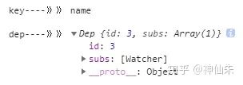

# 响应式原理 - 白话版

## 响应式系统

我们都知道，只要在 Vue 实例中声明过的数据，那么这个数据就是响应式的。

什么是响应式，也即是说，数据发生改变的时候，视图会重新渲染，匹配更新为最新的值。

也正是因为这个系统，让我们可以脱离界面的束缚，只需要操作数据。

我们可以问出下面三个问题

1. Vue 是怎么知道数据改变？

2. Vue 在数据改变时，怎么知道通知哪些视图更新？

3. Vue 在数据改变时，视图怎么知道什么时候更新？

问题的谜底将在下面一一解开

现在，我将会讲解三个重要的概念

Object.defineProperty，依赖收集，依赖更新

<br> <br>

Object.defineProperty
这个方法，是 Vue 响应式系统的精髓，骨髓，脑髓

使用 Object.defineProperty 可以为对象中的每一个属性，设置 get 和 set 方法

Object.defineProperty 可以为属性设置很多特性，例如 configurable，enumerable，但是现在不过多解释，重点只放在 get 和 set

<br>

那么 get 和 set 方法有什么用？
get 值是一个函数，当属性被访问时，会触发 get 函数

set 值同样是一个函数，当属性被赋值时，会触发 set 函数

<br>

举个例子

```js
var obj={    
    name:"神仙朱"
}
Object.defineProperty(obj,"name",{
    get(){        
        console.log("get 被触发")
    },
    set(val){        
        console.log("set 被触发")
    }
})
```
当我访问 obj.name 时，会打印 `get 被触发`

当我为 obj.name 赋值时，obj.name = 5，会打印`set 被触发`

这便可以回答了我开篇的第一个问题

Vue 是怎么知道数据改变的呢？

恩，Vue 在 属性的 set 方法中做了手脚，因而当数据改变时，触发 属性的 set 方法，Vue 就能知道数据有改变

<br> <br>

## 依赖收集

简单地说
data 中的声明的每个属性，都拥有一个数组，保存着 谁依赖（使用）了 它

<br>

举个例子

```js
new Vue({    
    data(){        
        return {            
            name:"神仙朱"        
        }    
    }
})
```

然后 页面A 引用了name

`<div>{{name}}</div>`

此时，name 把 页面 A 存在它的后宫中（这个页面依赖我）

<br>

为什么呢？
因为它知道谁依赖它之后，它就可以在发生改变的时候，通知 依赖它的页面，从而让页面完成更新

<br>

TIP

实际上，会依赖 name 的地方，不只是页面，还会有 computed，watch.... 等等，但是这里我们全部使用页面一词替代

这就是依赖收集，把 依赖了我（使用了我的东西），统统保存起来。

可是，保存在哪里，具体保存的是什么东西，我们这里暂时不深入，因为这是白话文。

我按上面的例子，从Vue 内部打印一份数据供大家简单了解即可



在这里插入图片描述 可以看到，name 属性，使用了 一个 dep 保存了 页面A 这个依赖，而保存的实际上是 页面A的 Watcher。

<br>

TIP

简单说一下，watcher 是什么，每个 Vue 实例都会拥有一个专属的 watcher，可用于实例更新

<br>

总结一下

1. data 中每个声明的属性，都会有一个 专属的依赖收集器 subs

2. 当页面使用到 某个属性时，页面的 watcher 就会被 放到 依赖收集器 subs 中

数据 是在什么时候进行 收集依赖 的呢？

答案是，ObjectdefineProperty - get

当 页面 A 读取了 name 时，会触发 name 的 get 函数，此时，name 就会保存 页面A 的 watcher 啦！

这便可以回答了我开篇的第二个问题

Vue 在数据改变时，怎么知道通知哪些视图更新？

恩，通知那些存在 依赖收集器中的 视图

<br> <br>

## 依赖更新

依赖更新，就是，通知所有的依赖进行更新

经过上面的讲解，我们都知道，每个属性都会保存有一个 依赖收集器 subs

而这个 依赖收集器，是用来在 数据变化时，通知更新的

数据 是在 什么时候进行 依赖更新 的呢？

答案是，Object.defineProperty - set

<br>

以上面的 Vue 实例 为例

当 name 改变的时候，name 会遍历自己的 依赖收集器 `subs`，逐个通知` watcher`，让 watcher 完成更新

这里 name 会通知 页面A，页面A 重新读取新的 name ，然后完成渲染

<br>

这便可以回答了我开篇的第二个问题

Vue 在数据改变时，视图怎么知道什么时候更新?

恩，在数据变化触发 set 函数时，通知视图，视图开始更新

<br>

简单总结

1. Object.defineProperty - get ，用于 依赖收集

2. Object.defineProperty - set，用于 依赖更新

3. 每个 data 声明的属性，都拥有一个的专属依赖收集器 subs

4. 依赖收集器 subs 保存的依赖是 watcher

5. watcher 可用于 进行视图更新