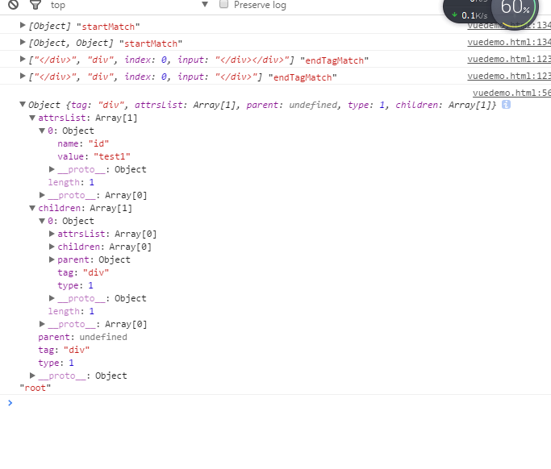

# vue源码之htmlParse解析器的实现

## 解析小例子

我们最终的目标是将html转换成ast对象

```html
    <div id="div1"></div>
```

我希望将上面的html解析成ast格式，类似于下面

```js
    {
    "tag":"div",
    "attrs":[
                {  "id":"div1" }
    ],
    "children":[],
    "type":1
    }    
```

::: v-pre

最终想要达成的第一个小目标是可以将div标签字符串输出成这样一个object格式，`tag`表示标签名称，`attrs`表示属性，`children`表示这个div所有的子节点，`type`的话表示节点的类型，我们今天只三个类型：

1. 元素类型，也就是标签类型，所有用`<tag attr=""></tag>`这样的标签。
2. 变量text，现在我们实现一个`{{text}}`的变量转换，它其实是一个节点。
3. 普通文本，普通文本包括普通文字和空格、换行。


本结构的设计决定的代码能扩展多远，如果一开始结构设计错误，最后在新加入的功能无法嵌入的时候，那就只有重构一条路可以走了。

　　首先理清楚我们的思路。

> 匹配单个字符》匹配标签》匹配属性》匹配文本》匹配结束标签

然后，你想啊，html标签都是有开始，有结束的。那么这里问题就来了，可以想到的方式，解析一个标签的开始与结束吧，例如我们使用正则匹配开始标`div id='div1'>`然后找到结束标签`</div>`,这样是不是就可以解析div里面的内容了？

开始标签比较好找，结束标签就恶心了，例如 `<div><div></div></div>` ，，完了，怎么区分嵌套关系？第一个`<div>`到底匹配哪一个结束标签？

这个思路是错的，很难。

那么我们换个思路，如果我们单个字符匹配呢，

例如我们匹配一个 `<div><div></div></div>`,


> ok 脑补步骤

1. 匹配到 <   匹配到这个字符我就可以认为，后面的要么是开始标签，要么是结束标签。

2. 用正则匹配从<到后面的字符，如果是开始标签，现在记录一下，啊，我遇到了一个开始标签`<div>`  顺便用正则记录attrs

3. 现在我们匹配走走走。。。走到`<div></div></div>  ` 

4. 又匹配到一个 < 老步骤啊。

5. 发现是开始标签，再次记录，啊，我又遇到一个开始标签  `<div> ` 顺便用正则记录attrs

6. 现在我们匹配走走走。。。走到`</div></div> ` 

7. 又匹配到一个 < 老步骤啊。

8. 发现是一个结束标签`</div>` ,嗯？结束标签！它是谁的结束标签？想一想。。。。。。应该是最后一个遇到的开始标签吧。  第一个遇到的结束标签不就是最后一个开始标签的结束么？

9. 啊，结束了一个。 

10. 再匹配，再完成。

## 实现代码

```js
    //转化HTML至AST对象
  function parse(template){
    var currentParent; //当前父节点
    var root; //最终生成的AST对象
    var stack = []; //插入栈
    var startStack = []; //开始标签栈
    var endStack = [];  //结束标签栈
    //console.log(template);
    parseHTML(template,{
      start:function start(targetName,attrs,unary,start,end,type,text){//标签名 ，attrs，是否结束标签，文本开始位置，文本结束位置，type，文本，
        var element = {   //我们想要的对象
          tag:targetName,
          attrsList:attrs,
          parent:currentParent,  //需要记录父对象吧
          type:type,
          children:[]
        }
        if(!root){ //根节点哈
          root = element;
        }
        if(currentParent && !unary){ //有父节点并且不是结束标签？
          currentParent.children.push(element);  //插入到父节点去
          element.parent = currentParent;  //记录父节点
        }
        if (!unary) {  //不是结束标签？
            if(type == 1){
               currentParent = element;//不是结束标签，当前父节点就要切换到现在匹配到的这个开始标签哈，后面再匹配到
               startStack.push(element);  //推入开始标签栈
            }
             stack.push(element);  //推入总栈
         }else{
           endStack.push(element);  //推入结束标签栈
           currentParent = startStack[endStack.length-1].parent;   //结束啦吧当前父节点切到上一个开始标签，这能理解吧，当前这个已经结束啦
         }
         //console.log(stack,"currentstack")
      },
      end:function end(){

      },
      chars:function chars(){

      }
    });
    console.log(root,"root");
    return root;
  };
  /**
   * Not type-checking this file because it's mostly vendor code.
   */

  /*!
   * HTML Parser By John Resig (ejohn.org)
   * Modified by Juriy "kangax" Zaytsev
   * Original code by Erik Arvidsson, Mozilla Public License
   * http://erik.eae.net/simplehtmlparser/simplehtmlparser.js
   */

  // Regular Expressions for parsing tags and attributes
  var singleAttrIdentifier = /([^\s"'<>/=]+)/;
  var singleAttrAssign = /(?:=)/;
  var singleAttrValues = [
    // attr value double quotes
    /"([^"]*)"+/.source,
    // attr value, single quotes
    /'([^']*)'+/.source,
    // attr value, no quotes
    /([^\s"'=<>`]+)/.source
  ];
  var attribute = new RegExp(
    '^\\s*' + singleAttrIdentifier.source +
    '(?:\\s*(' + singleAttrAssign.source + ')' +
    '\\s*(?:' + singleAttrValues.join('|') + '))?'
  );
  // could use https://www.w3.org/TR/1999/REC-xml-names-19990114/#NT-QName
  // but for Vue templates we can enforce a simple charset
  var ncname = '[a-zA-Z_][\\w\\-\\.]*';
  var qnameCapture = '((?:' + ncname + '\\:)?' + ncname + ')';
  var startTagOpen = new RegExp('^<' + qnameCapture);
  var startTagClose = /^\s*(\/?)>/;
  var endTag = new RegExp('^<\\/' + qnameCapture + '[^>]*>');
  var doctype = /^<!DOCTYPE [^>]+>/i;
  var comment = /^<!--/;
  var conditionalComment = /^<!\[/;

//偷懒哈  上面的正则是我在vue上拿下来的，这个后期可以研究，下面的话简单的写两个用用，和vue原版的是有一些差别的

    //{{变量}}

  var varText = new RegExp('{{' + ncname + '}}');
  //空格与换行符
  var space = /^\s/;
  var checline = /^[\r\n]/;
    /**
      type 1普通标签
      type 2代码
      type 3普通文本
    */
  function parseHTML(html,options){
    var stack = []; //内部也要有一个栈
    var index = 0;  //记录的是html当前找到那个索引啦
    var last; //用来比对，当这些条件都走完后，如果last==html 说明匹配不到啦，结束while循环
    var isUnaryTag = false;

    while(html){
      last = html;
      var textEnd = html.indexOf('<');
      if(textEnd === 0){ //这一步如果第一个字符是<那么就只有两种情况，1开始标签  2结束标签
        //结束标签
        var endTagMatch = html.match(endTag); //匹配
        if(endTagMatch){
          console.log(endTagMatch,"endTagMatch");
          isUnaryTag = true;
          var start = index;
          advance(endTagMatch[0].length); //匹配完要删除匹配到的，并且更新index，给下一次匹配做工作
          options.start(null,null,isUnaryTag,start,index,1);
          continue;
        }
        //初始标签
        var startMatch = parseStartTag();
        if(startMatch){
          parseStartHandler(startMatch);//封装处理下
          console.log(stack,"startMatch");
          continue;
        }
      }

      if(html === last){
        console.log(html,"html");
       break;
      }
    }
    function advance (n) {
      index += n;
      html = html.substring(n);
    }
    //处理起始标签 主要的作用是生成一个match 包含初始的attr标签
    function parseStartTag(){
      var start = html.match(startTagOpen);
      if(start){
        var match = {
           tagName: start[1],       // 标签名(div)
           attrs: [],               // 属性
           start: index             // 游标索引(初始为0)
       };
       advance(start[0].length);
       var end, attr;
       while (!(end = html.match(startTagClose)) && (attr = html.match(attribute))) {//在endClose之前寻找attribute
           advance(attr[0].length);
           match.attrs.push(attr);
       }
       if (end) {
           advance(end[0].length);      // 标记结束位置
           match.end = index;      //这里的index 是在 parseHTML就定义 在advance里面相加
           return match         // 返回匹配对象 起始位置 结束位置 tagName attrs
       }

      }
    }
    //对match进行二次处理，生成对象推入栈
    function parseStartHandler(match){
      var _attrs = new Array(match.attrs.length);
      for(var i=0,len=_attrs.length;i<len;i++){  //这儿就是找attrs的代码哈
        var args = match.attrs[i];
        var value = args[3] || args[4] || args[5] || '';
        _attrs[i] = {
          name:args[1],
          value:value
        }
      }
      stack.push({tag: match.tagName,type:1, lowerCasedTag: match.tagName.toLowerCase(), attrs: _attrs}); //推栈
      options.start(match.tagName, _attrs,false, match.start, match.end,1);  //匹配开始标签结束啦。
    }

  }
```

执行parse`("<div id='test1'><div></div></div>")`;



:::

::: tip
Vue 2.0 的 Parse 原型基于 John Resig 的 HTML Parser，这个 Parser 写的很小巧，可以到这里了解 http://ejohn.org/blog/pure-javascript-html-parser/
:::
