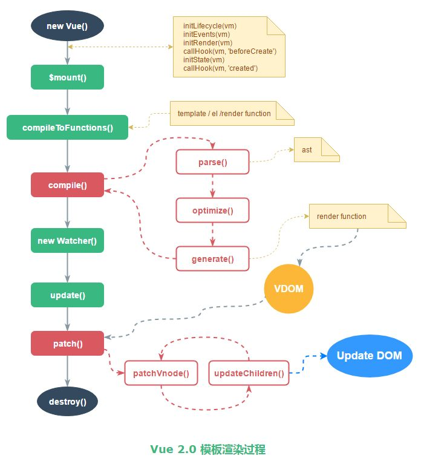

# 深入vue2.0模板渲染底层思想

## vue2.0和1.0模板渲染的区别

`Vue 2.0` 中模板渲染与 Vue 1.0 完全不同，1.0 中采用的 `DocumentFragment` （想了解可以观看这篇文章），而 2.0 中借鉴 `React` 的 `Virtual DOM`。基于 Virtual DOM，2.0 还可以支持服务端渲染（SSR），也支持 JSX 语法（改良版的 render 函数）。

## 知识普及

在开始阅读源码之前，先了解一些相关的知识：AST 数据结构，VNode 数据结构，createElement 的问题，render函数。

### AST 数据结构

`AST` 的全称是 `Abstract Syntax Tree`（抽象语法树），是源代码的抽象语法结构的树状表现形式，计算机学科中编译原理的概念。而vue就是将模板代码映射为AST数据结构，进行语法解析。

我们看一下 Vue 2.0 源码中 AST 数据结构 的定义：
```js
declare type ASTNode = ASTElement | ASTText | ASTExpression
declare type ASTElement = { // 有关元素的一些定义
  type: 1;
  tag: string;
  attrsList: Array<{ name: string; value: string }>;
  attrsMap: { [key: string]: string | null };
  parent: ASTElement | void;
  children: Array<ASTNode>;
  //......
}
declare type ASTExpression = {
  type: 2;
  expression: string;
  text: string;
  static?: boolean;
}
declare type ASTText = {
  type: 3;
  text: string;
  static?: boolean;
}
```
我们看到 ASTNode 有三种形式：`ASTElement，ASTText，ASTExpression`用属性 type 区分。

### VNode数据结构

下面是 Vue 2.0 源码中 `VNode 数据结构` 的定义 (带注释的跟下面介绍的内容有关)：

```js
constructor {
  this.tag = tag   //元素标签
  this.data = data  //属性
  this.children = children  //子元素列表
  this.text = text
  this.elm = elm  //对应的真实 DOM 元素
  this.ns = undefined
  this.context = context 
  this.functionalContext = undefined
  this.key = data && data.key
  this.componentOptions = componentOptions
  this.componentInstance = undefined
  this.parent = undefined
  this.raw = false
  this.isStatic = false //是否被标记为静态节点
  this.isRootInsert = true
  this.isComment = false
  this.isCloned = false
  this.isOnce = false
}
```
真实DOM存在什么问题，为什么要用虚拟DOM

我们为什么不直接使用原生 DOM 元素，而是使用真实 DOM 元素的简化版 `VNode`，最大的原因就是 document.createElement 这个方法创建的真实 DOM 元素会带来性能上的损失。我们来看一个 `document.createElement` 方法的例子

```js
let div = document.createElement('div');
for(let k in div) {
  console.log(k);
}
```

打开 console 运行一下上面的代码，会发现打印出来的属性多达 228 个，而这些属性有 90% 多对我们来说都是无用的。`VNode` 就是简化版的真实 DOM 元素，关联着真实的dom，比如属性elm，只包括我们需要的属性，并新增了一些在 diff 过程中需要使用的属性，例如 isStatic。

### render函数

这个函数是通过编译模板文件得到的，其运行结果是 `VNode`。render 函数 与 JSX 类似，`Vue 2.0` 中除了 `Template` 也支持 `JSX` 的写法。大家可以使用 `Vue.compile(template)`方法编译下面这段模板。
```html
<div id="app">
  <header>
    <h1>I am a template!</h1>
  </header>
  <p v-if="message">
    {{ message }}
  </p>
  <p v-else>
    No message.
  </p>
</div>
```

方法会返回一个对象，对象中有 `render` 和 `staticRenderFns` 两个值。看一下生成的 `render` 函数

```js
(function() {
  with(this){
    return _c('div',{   //创建一个 div 元素
      attrs:{"id":"app"}  //div 添加属性 id
      },[
        _m(0),  //静态节点 header，此处对应 staticRenderFns 数组索引为 0 的 render 函数
        _v(" "), //空的文本节点
        (message) //三元表达式，判断 message 是否存在
         //如果存在，创建 p 元素，元素里面有文本，值为 toString(message)
        ?_c('p',[_v("\n    "+_s(message)+"\n  ")])
        //如果不存在，创建 p 元素，元素里面有文本，值为 No message. 
        :_c('p',[_v("\n    No message.\n  ")])
      ]
    )
  }
})
```

要看懂上面的 render函数，只需要了解` _c，_m，_v，_s `这几个函数的定义，其中 `_c `是 `createElement`（创建元素），`_m` 是 `renderStatic`（渲染静态节点），`_v `是 `createTextVNode`（创建文本dom），`_s` 是 `toString` （转换为字符串）

除了 render 函数，还有一个 `staticRenderFns` 数组，这个数组中的函数与 VDOM 中的 diff 算法优化相关，我们会在编译阶段给后面不会发生变化的 VNode 节点打上 static 为 true 的标签，那些被标记为静态节点的` VNode` 就会单独生成 `staticRenderFns` 函数

```js
(function() { //上面 render 函数 中的 _m(0) 会调用这个方法
  with(this){
    return _c('header',[_c('h1',[_v("I'm a template!")])])
  }
})
```

## 模板渲染过程

了解完一些基础知识后，接下来我们讲解下模板的渲染过程



> `$mount` 函数，主要是获取 `template`，然后进入 `compileToFunctions` 函数。

> `compileToFunctions` 函数，主要将 `template `编译成 `render` 函数。首先读缓存，没有缓存就调用 `compile` 方法拿到 `render` 函数 的字符串形式，再通过 `new Function` 的方式生成 `render` 函数。

```js
// 有缓存的话就直接在缓存里面拿
const key = options && options.delimiters
            ? String(options.delimiters) + template
            : template
if (cache[key]) {
    return cache[key]
}
const res = {}
const compiled = compile(template, options) // compile 后面会详细讲
res.render = makeFunction(compiled.render) //通过 new Function 的方式生成 render 函数并缓存
const l = compiled.staticRenderFns.length
res.staticRenderFns = new Array(l)
for (let i = 0; i < l; i++) {
    res.staticRenderFns[i] = makeFunction(compiled.staticRenderFns[i])
}
......
}
return (cache[key] = res) // 记录至缓存中
compile 函数就是将 template 编译成 render 函数的字符串形式，后面一小节我们会详细讲到。

完成render方法的生成后，会进入 _mount 中进行DOM更新。该方法的核心逻辑如下：

// 触发 beforeMount 生命周期钩子
callHook(vm, 'beforeMount')
// 重点：新建一个 Watcher 并赋值给 vm._watcher
vm._watcher = new Watcher(vm, function updateComponent () {
  vm._update(vm._render(), hydrating)
}, noop)
hydrating = false
// manually mounted instance, call mounted on self
// mounted is called for render-created child components in its inserted hook
if (vm.$vnode == null) {
  vm._isMounted = true
  callHook(vm, 'mounted')
}
return vm
```

首先会new一个`watcher对象`（主要是将模板与数据建立联系），在watcher对象创建后，会运行传入的方法 `vm._update(vm._render()`, hydrating) 。其中的`vm._render()`主要作用就是运行前面`compiler`生成的r`ender`方法，并返回一个`vNode对象`。`vm.update() `则会对比`新的 vdom `和`当前 vdom`，并把差异的部分渲染到真正的 DOM 树上。
（想深入了解watcher的背后实现原理的，可以观看这篇文章 Vue2.0 源码阅读：响应式原理）

#### compile

上文中提到 compile 函数就是将 template 编译成 render 函数 的字符串形式。

```js

export function compile (
  template: string,
  options: CompilerOptions
): CompiledResult {
  const AST = parse(template.trim(), options) //1. parse
  optimize(AST, options)  //2.optimize
  const code = generate(AST, options) //3.generate
  return {
    AST,
    render: code.render,
    staticRenderFns: code.staticRenderFns
  }
}
```

这个函数主要有三个步骤组成：`parse，optimize 和 generate`，分别输出一个包含 `AST，staticRenderFns 的对象`和 `render函数` 的字符串。

> `parse` 函数，主要功能是将 `template`字符串解析成 `AST`。前面定义了`ASTElement的数据结构`，`parse` 函数就是将`template`里的结构（指令，属性，标签等）转换为AST形式存进ASTElement中，最后解析生成AST。

> `optimize` 函数（src/compiler/optimizer.js）主要功能就是标记静态节点，为后面 patch 过程中对比新旧 VNode 树形结构做优化。被标记为 static 的节点在后面的 diff 算法中会被直接忽略，不做详细的比较。

> `generate`函数（src/compiler/codegen/index.js）主要功能就是根据 `AST` 结构拼接生成 `render` 函数的字符串。

```js
const code = AST ? genElement(AST) : '_c("div")' 
staticRenderFns = prevStaticRenderFns
onceCount = prevOnceCount
return {
    render: `with(this){return ${code}}`, //最外层包一个 with(this) 之后返回
    staticRenderFns: currentStaticRenderFns
}
```

其中 `genElement` 函数（src/compiler/codegen/index.js）是会根据 AST 的属性调用不同的方法生成字符串返回。

```js
function genElement (el: ASTElement): string {
  if (el.staticRoot && !el.staticProcessed) {
    return genStatic(el)
  } else if (el.once && !el.onceProcessed) {
    return genOnce(el)
  } else if (el.for && !el.forProcessed) {
    return genFor(el)
  } else if (el.if && !el.ifProcessed) {
    return genIf(el)
  } else if (el.tag === 'template' && !el.slotTarget) {
    return genChildren(el) || 'void 0'
  } else if (el.tag === 'slot') {
  }
    return code
  }
}
```

以上就是 `compile` 函数中三个核心步骤的介绍，`compile` 之后我们得到了 `render 函数` 的字符串形式，后面通过 `new Function `得到真正的渲染函数。数据发现变化后，会执行 `Watcher` 中的 `_update` 函数（src/core/instance/lifecycle.js），`_update` 函数会执行这个渲染函数，输出一个新的 VNode 树形结构的数据。然后在调用 patch 函数，拿这个新的 VNode 与旧的 VNode 进行对比，只有发生了变化的节点才会被更新到真实 DOM 树上。

#### patch

`patch.js` 就是新旧 VNode 对比的 `diff 函数`，主要是为了优化dom，通过算法使操作dom的行为降到最低，`diff` 算法来源于 `snabbdom`，是 `VDOM` 思想的核心。`snabbdom` 的算法为了 DOM 操作跨层级增删节点较少的这一目标进行优化，它只会在同层级进行, 不会跨层级比较。

想更加深入VNode diff算法原理的，可以观看（解析vue2.0的diff算法）

总结

* compile 函数主要是将 template 转换为 AST，优化 AST，再将 AST 转换为 render函数；
* render函数 与数据通过 Watcher 产生关联；
* 在数据发生变化时调用 patch 函数，执行此 render 函数，生成新 VNode，与旧 VNode 进行 diff，最终更新 DOM 树。